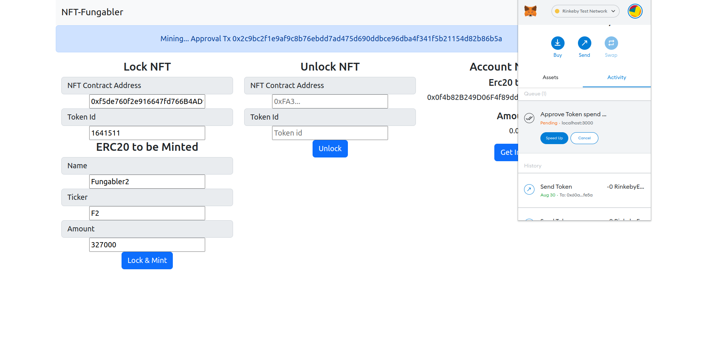

# NFT Fungabler

## Idea

Since it's hard to get a little bit of value for your jpegs these days. Why not lock it up in a smartcontract and sell shares of it.

### NftFungabler

A contract that locks an ERC721 token and creates a specified amount of ERC20 tokens. In order to unlock the NFT from the smartcontract, the account needs to hold ALL ERC20 tokens.
[Verified Etherscan Rinkeby Contractaddress](https://rinkeby.etherscan.io/address/0xA9e8F63DF4FDA562cb3C9c18BaD73F86fE4e68b9#code)

  

### ConstantFactorAmmDex

A contract to create a swapping pool.

## Directory Structure

| Folder    | Content                           |                          |
| --------- | --------------------------------- | ------------------------ |
| Contracts | Solidity smartcontracts           |                          |
|           |                                   | NftFungabler.sol         |
|           |                                   | ConstantFactorAmmDex.sol |
| Scripts   | Scripts to deploy smartcontracts  |                          |
|           |                                   | deploy.js                |
| Test      | Smartcontract tests in Javascript |                          |
|           |                                   | NftFungabler.js          |

## Run smartcontract tests

- In terminal, `git clone https://github.com/Martijncvv/nft-fungabler.git`
- In terminal at project root folder, `npm install`
- In terminal at project root folder, `npx hardhat test test/NftFungabler.js `

## Personal Rinkeby Test NFT Data

nftContract: 0xf5de760f2e916647fd766B4AD9E85ff943cE3A2b
nftID: 1641511
